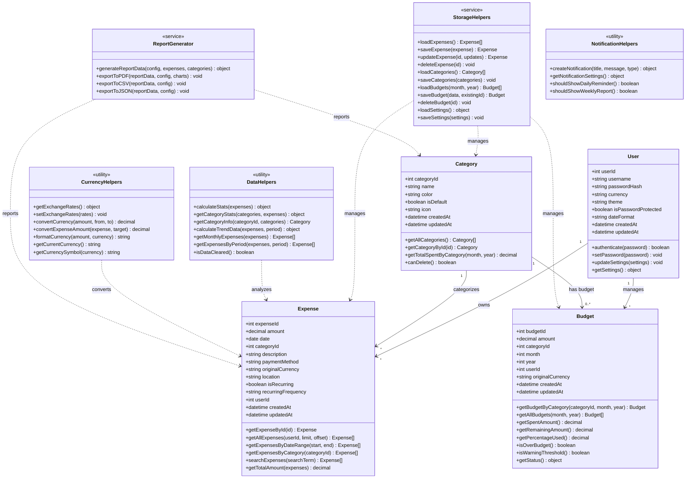
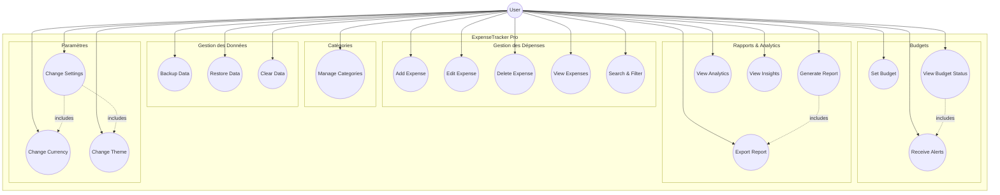
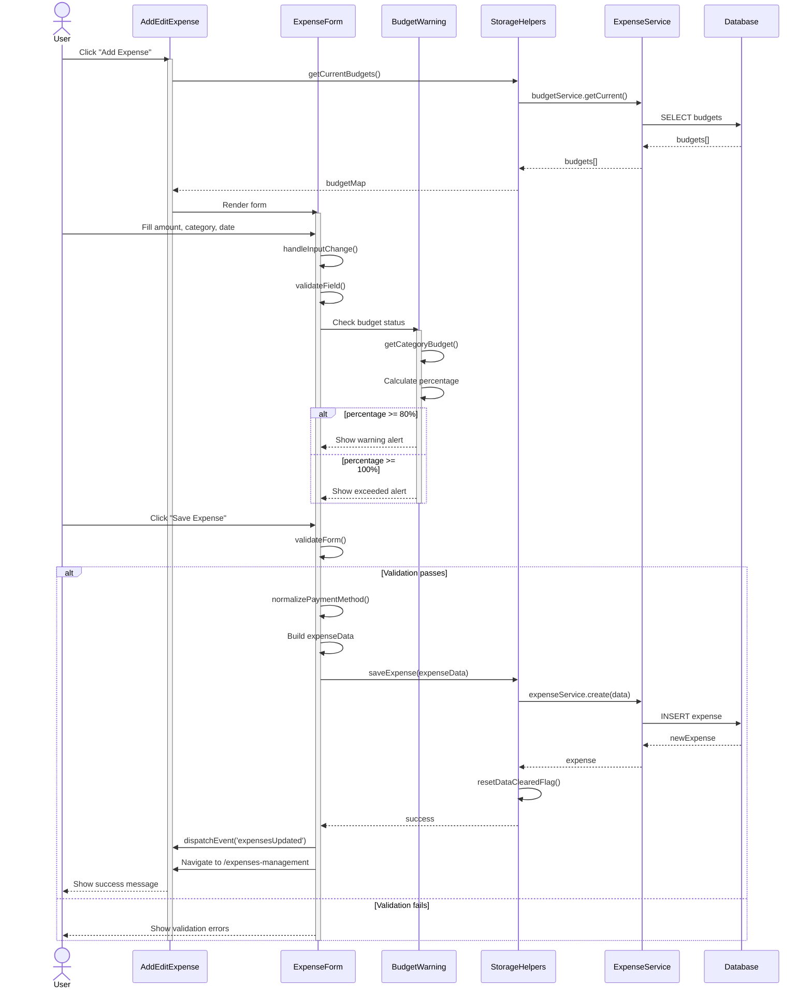
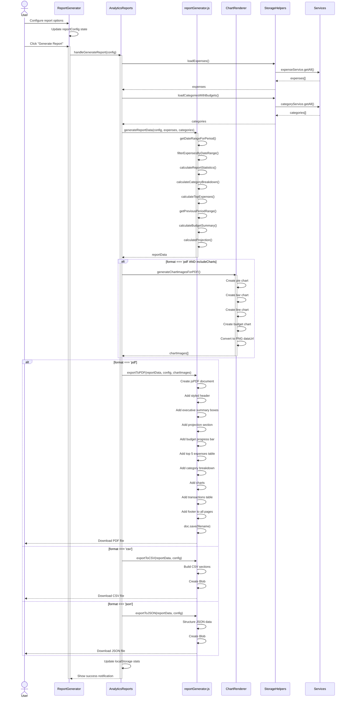
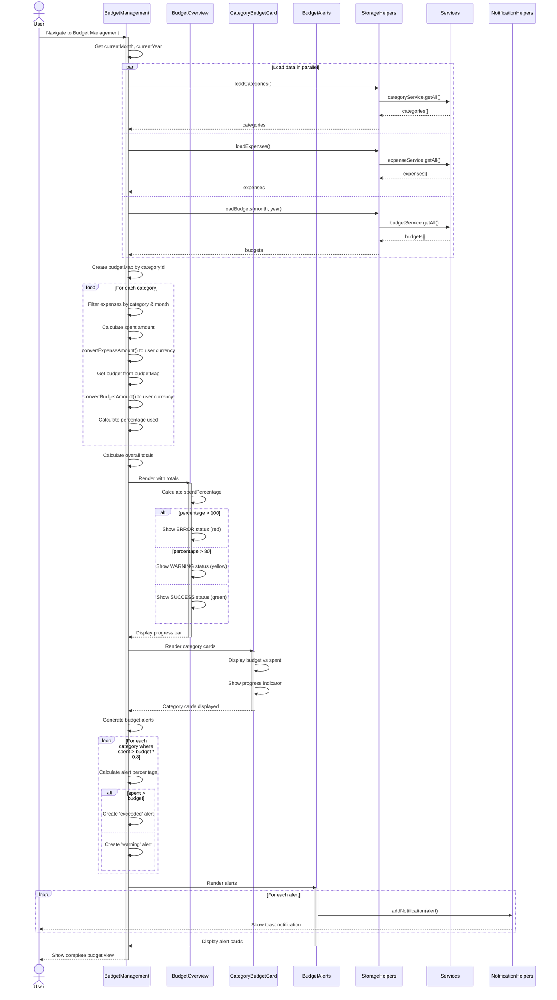
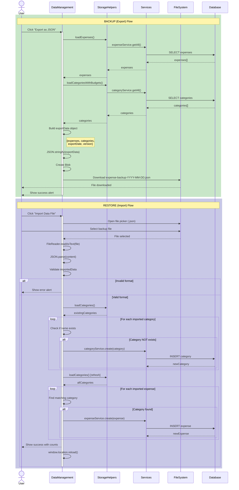
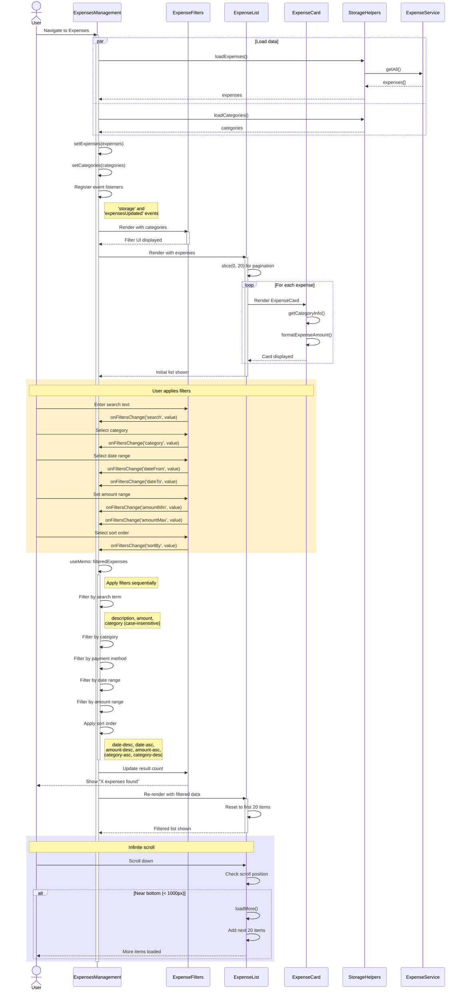

# Diagrammes UML - ExpenseTracker Pro

Ce document contient tous les diagrammes UML du système ExpenseTracker Pro en format Mermaid.

**Comment visualiser ces diagrammes:**
1. **VS Code**: Installer l'extension "Markdown Preview Mermaid Support"
2. **En ligne**: Copier le code sur [mermaid.live](https://mermaid.live)
3. **GitHub/GitLab**: Les diagrammes s'affichent automatiquement

---

## Table des Matières

1. [Class Diagram](#1-class-diagram)
2. [Use Case Diagram](#2-use-case-diagram)
3. [Sequence Diagrams](#3-sequence-diagrams)
   - [3.1 Add Expense](#31-add-expense)
   - [3.2 Generate Report and Export](#32-generate-report-and-export)
   - [3.3 View Budget with Status Alert](#33-view-budget-with-status-alert)
   - [3.4 Backup and Restore Data](#34-backup-and-restore-data)
   - [3.5 Search and Filter Expenses](#35-search-and-filter-expenses)

---

## 1. CLASS DIAGRAM

Ce diagramme représente les entités principales du système et leurs relations.

### Entités Principales
- **User**: Utilisateur du système avec ses préférences
- **Expense**: Dépense avec montant, catégorie, date
- **Category**: Catégorie de dépense avec couleur et icône
- **Budget**: Budget mensuel par catégorie

### Services et Utilitaires
- **StorageHelpers**: Gestion de la persistance (API)
- **DataHelpers**: Calculs et statistiques
- **CurrencyHelpers**: Conversion de devises
- **ReportGenerator**: Génération de rapports
- **NotificationHelpers**: Gestion des notifications

---

## 2. USE CASE DIAGRAM

Ce diagramme montre toutes les fonctionnalités accessibles à l'utilisateur.

### Catégories de Fonctionnalités
- **Gestion des dépenses**: Ajouter, modifier, supprimer, visualiser, rechercher
- **Gestion des catégories**: Créer et gérer les catégories
- **Gestion des budgets**: Définir budgets, voir statut, recevoir alertes
- **Rapports et Analytics**: Générer rapports, exporter, voir insights
- **Données**: Sauvegarder, restaurer, effacer
- **Paramètres**: Devise, thème, préférences

---

## 3. SEQUENCE DIAGRAMS

### 3.1 Add Expense

Ce diagramme montre le flux complet pour ajouter une nouvelle dépense, incluant:
- Chargement des budgets pour l'avertissement
- Validation du formulaire
- Sauvegarde via API
- Notification de mise à jour

---

### 3.2 Generate Report and Export

Ce diagramme montre le processus de génération de rapport avec:
- Configuration des options (période, format, etc.)
- Chargement des données
- Génération des statistiques et graphiques
- Export en PDF, CSV ou JSON

---

### 3.3 View Budget with Status Alert

Ce diagramme montre comment les budgets sont affichés avec:
- Chargement parallèle des données
- Calcul des dépenses par catégorie
- Conversion de devises
- Génération et affichage des alertes

---

### 3.4 Backup and Restore Data

Ce diagramme montre les deux flux:
- **Backup (Export)**: Collecte des données et téléchargement en JSON
- **Restore (Import)**: Lecture du fichier, validation et importation

---

### 3.5 Search and Filter Expenses

Ce diagramme montre le système de recherche et filtrage avec:
- Chargement initial des données
- Application des filtres multiples
- Tri des résultats
- Infinite scroll pour la pagination

---

## Annexes

### Filtres Disponibles (Search & Filter)

| Filtre | Type | Description |
|--------|------|-------------|
| search | texte | Recherche dans description, montant, catégorie |
| category | select | Filtre par catégorie unique |
| paymentMethod | select | Cash, Card, Bank Transfer, Digital Wallet, Other |
| dateFrom | date | Date de début (inclusive) |
| dateTo | date | Date de fin (inclusive) |
| amountMin | number | Montant minimum |
| amountMax | number | Montant maximum |
| sortBy | select | date-desc, date-asc, amount-desc, amount-asc, category-asc, category-desc |

### Niveaux d'Alerte Budget

| Niveau | Condition | Couleur |
|--------|-----------|---------|
| Normal | < 80% | Vert |
| Warning | 80% - 100% | Jaune |
| Exceeded | > 100% | Rouge |

### Formats d'Export

| Format | Extension | Contenu |
|--------|-----------|---------|
| PDF | .pdf | Rapport complet avec graphiques |
| CSV | .csv | Données tabulaires |
| JSON | .json | Données structurées complètes |

---

*Document généré pour ExpenseTracker Pro - Décembre 2024*
